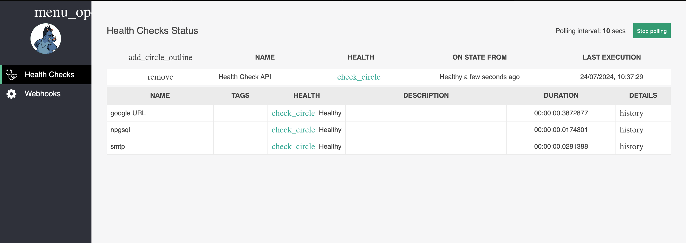
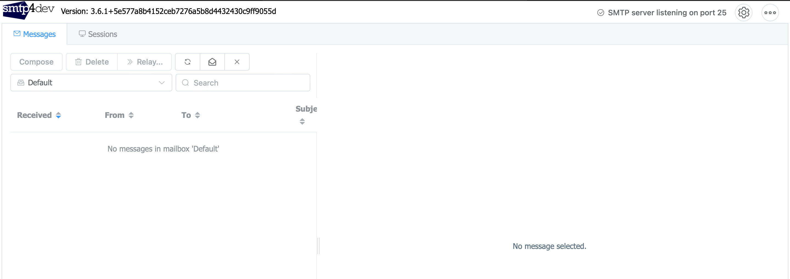
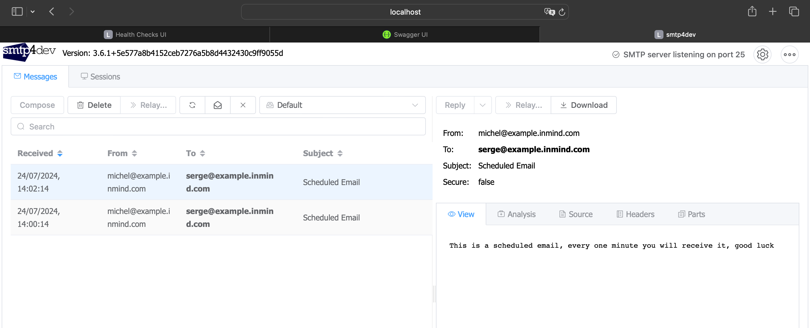
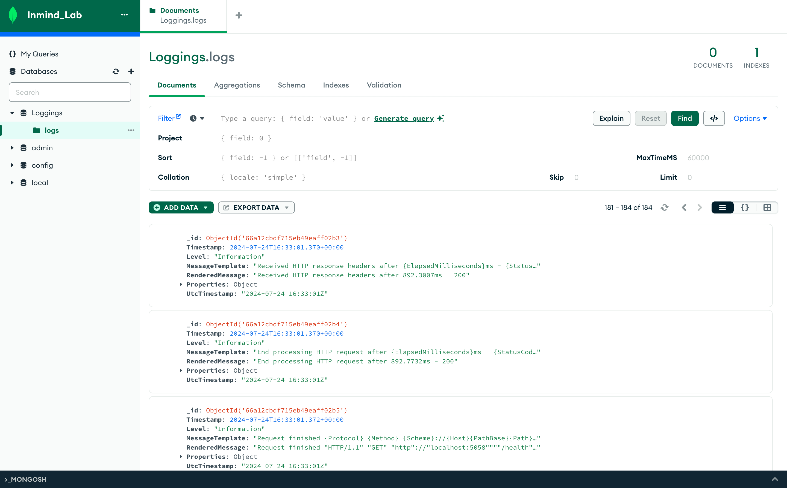

# LAB 5: Web API UMS (University Management System)

## MISSION
In this lab you will create a Web API UMS (University Management System).
An admin Create a course and set the Maximum number of students allowed and the
enrollment date range
A Teacher registers that s/he can teach this course and create the time slot that s/he can teach
at and can assign the course that they can teach to a time slot.
A student can enroll in a course if he is trying in the date range allowed.

## VISION
The Web API should be designed using the DDD architecture, use the Database provided run
the script in postgres console, Git is a must every feature should be on branch ex:
feature/{counter}-{small-description}, Create the required endpoints to apply the logic
described above.
Some of the GET endpoints must be using OData
Add Caching to your persistence layer for 30 min lifetime.
Add API versioning, you should be able to control from App settings.
Add a feature as a teacher I must be able to set a grade for a student for a course, the Grade
average of a student must be update every time a teacher adds a grade for a student and add a
Boolean value must be update in case the student average is greater than 15 the Boolean value
CanApplyToFrance is true.
As a Plus: Add upload profile picture for the user NB: The DB needs update to support this
feature save the files in wwwroot.

### Commands Used:
#### add / remove reference command:
dotnet add reference ../LabSession5.Infrastructure/LabSession5.Infrastructure.csproj
dotnet remove reference ../LabSession5.Infrastructure/LabSession5.Infrastructure.csproj

### Dependencies installed:
Microsoft.EntityFrameworkCore.Tools
Microsoft.EntityFrameworkCore.Design
Npgsql.EntityFrameworkCore.PostgreSQL

### Design patterns and logic:
Mediator Dp: to reduce chaotic dependencies between objects.
CQRS (Command and Query Responsibility Segregation): a pattern that separates read and update operations for a data store.

### Migrations and code-first:
dotnet ef migrations add InitialCreate
dotnet ef database update

### Teacher Grade Student enrolled in specific class:
Using Chain of Responsibility, I implemented this feature adding exceptions and throwing logical errors:
Exceptions handled:
- not a student,
- not enrolled in the class given,
=> Teacher will specify the coeficient of the grade, the handler will calculate the given value on 20 and add it to the average on 20.

Chain of 3 Handlers:
- set grade check student and class,
- update average
- check if can apply for france

### Required packages for Health check:
- Microsoft.Extensions.Diagnostics.HealthChecks 
- AspNetCore.HealthChecks.Npgsql
- AspNetCore.HealthChecks.Network
- AspNetCore.HealthChecks.UI
- AspNetCore.HealthChecks.UI.InMemory.Storage
- AspNetCore.HealthChecks.UI.Client
- AspNetCore.HealthChecks.UI.Data
- AspNetCore.HealthChecks.UI.Core
- AspNetCore.HealthChecks.Uris

## SMTP TESTING (smtp4dev):
link: http://localhost:3000

command : docker run --rm -it -p 3000:80 -p 2525:25 rnwood/smtp4dev:v3

open source fake smtp server for testing purposes
https://mailosaur.com/blog/setting-up-a-fake-smtp-server-for-testing

### Background Jobs schedule email notification:

### Serilog : logging to mongodb:
packages:
- Serilog.AspNetCore
- Serilog.Sinks.MongoDB

# Michel BOU CHAHINE
## inmind.ai